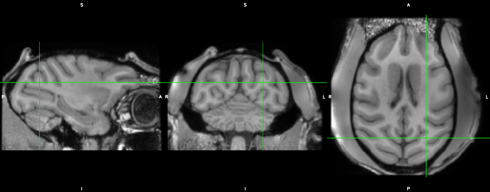

## NHP-BrainShift     
This repository documents the analysis approach to investigate potential shifts in brain position over time.     

### Data    
The `input` and `aligned` data folders are kept outside of the repo because of storage limitations. They can be accessed on `dropbox`.     

[input](https://www.dropbox.com/sh/ov50cjpc6ky1zim/AAB3WHWBT-Yyq6yPVeVtHfvva?dl=0)    
[normalized](https://www.dropbox.com/sh/5yrv7r5vgro1myk/AACHhJbwGJMESomObM6RktbYa?dl=0)     
[aligned](https://www.dropbox.com/sh/3mtk5iy5q9m72vk/AABwaNvl_1bst9WDXcW53JVRa?dl=0)    
[mask](https://www.dropbox.com/sh/8un6rq7ukumpgun/AABRCchIr6P3Ds6W5wN0yLEFa?dl=0)      
[4d](https://www.dropbox.com/sh/0l9lig2169sb2eu/AADiSTydMG8QTf_sE8opecCEa?dl=0)      

### Analysis      
The 4d data files are aligned scans covering a time period of 2 to 3 years. You can look at this with a viewer like [fsleyes](https://fsl.fmrib.ox.ac.uk/fsl/fslwiki/FSLeyes). Use the film-icon in the menubar to have the software cycle through the different volumes automatically.      

It will look somewhat like this:    

     

### Relevant literature     
In thinking about metrics, this paper may be relevant: [Feng et. al](/Literature/Feng_et_al-2010-Journal_of_The_Royal_Society_Interface.pdf)
